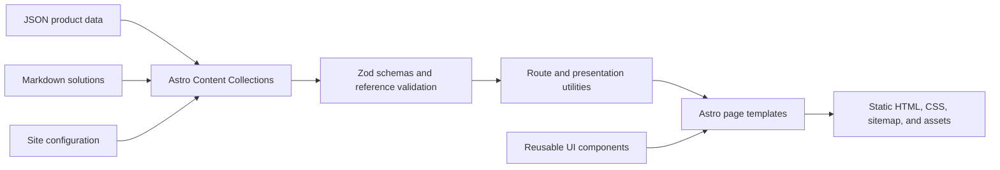

# Shengborun Communications Website

A production-oriented, content-driven corporate website for a professional communications equipment and solutions provider.

I independently designed and developed the entire project—from information architecture and responsive UI design to content modeling, automated testing, SEO, and the production deployment workflow.

[Live Website](https://www.shengborun.com/) · [中文说明](./README.zh-CN.md)


## Project at a Glance

| | |
| --- | --- |
| **Role** | Independent Designer & Developer |
| **Scope** | UX/UI design, frontend architecture, content modeling, testing, SEO, deployment |
| **Product catalog** | 4 categories and 49 published products |
| **Solution content** | 6 industry solution pages |
| **Delivery model** | Statically generated production website |

## The Challenge

The website needed to present a large, multi-level communications product catalog without becoming difficult to maintain. It also had to support long-form industry solution content, provide clear paths from discovery to inquiry, and remain usable across wide desktop, tablet, and narrow mobile layouts.

The main engineering challenge was therefore not a single page. It was designing a system in which structured business content, reusable UI components, dynamic routes, validation, and production operations could evolve independently without breaking the site.

## What I Built

- A responsive corporate design system with shared color, spacing, typography, radius, and interaction tokens.
- A content-driven product catalog backed by Astro Content Collections and strict Zod schemas.
- Statically generated category, product-detail, and industry-solution routes.
- Reusable product cards, category navigation, technical-parameter tables, feature presentation, breadcrumbs, header, and footer components.
- Responsive layouts designed for large desktop screens, tablets, standard mobile devices, and 320 px narrow screens.
- Page-level SEO metadata, canonical URLs, Open Graph metadata, sitemap generation, semantic page structure, and skip navigation.
- Content-reference validation that catches duplicate IDs, invalid category relationships, and unknown product features before deployment.
- Unit and browser-level regression tests covering routing, schemas, navigation, responsive layout, metadata, product presentation, and accessibility-oriented behavior.
- A documented production release and rollback workflow for the statically generated site.

## Engineering Decisions

### 1. Content is data, not page markup

Products and product categories are stored as structured JSON, while long-form solution pages use Markdown. Astro Content Collections load both formats through explicit schemas, keeping business content separate from layout implementation.

This makes adding a product primarily a content operation instead of a page-development task.

### 2. Routes are generated deterministically

Published categories and products are filtered and sorted through shared route utilities. Astro then generates category and product-detail pages at build time, producing predictable URLs such as:

```text
/products/
/{category}/
/{category}/{product}/
/solutions/{solution}/
```

### 3. Invalid content fails the build early

The build pipeline validates both individual documents and relationships across documents. It detects issues such as:

- duplicate category or product IDs;
- products pointing to unknown categories;
- published products referencing undefined feature definitions;
- malformed slugs and unsupported content fields.

This prevents content errors from silently becoming broken production pages.

### 4. Components follow content boundaries

Shared components map to stable presentation concepts—product cards, product heroes, technical parameters, solution cards, navigation, SEO, and layout—rather than to one-off pages. Page files remain responsible for composition and routing, while reusable display behavior stays isolated.

### 5. Responsive behavior is tested, not assumed

The browser test suite checks navigation usability, horizontal overflow, card geometry, category layouts, product-detail behavior, metadata, breadcrumbs, and technical-parameter presentation at multiple viewport sizes.

## Architecture



## Technology Stack

| Area | Technology |
| --- | --- |
| Framework | Astro 6 |
| Language | TypeScript with Astro strict mode |
| Content | Astro Content Collections, JSON, Markdown, Zod |
| UI | Astro components, scoped CSS, Lucide icons |
| Unit testing | Vitest |
| End-to-end testing | Playwright with Chromium |
| Package management | pnpm |
| Output | Static HTML/CSS/assets with generated sitemap |

## Quality Assurance

The repository contains dedicated unit and end-to-end suites.

Unit tests cover:

- content schemas and cross-content references;
- published-product selection and route generation;
- technical-parameter transformation;
- breadcrumb behavior and site configuration;
- separation between homepage and product-overview responsibilities.

Playwright tests cover:

- desktop and mobile navigation;
- responsive card and page layouts;
- product category and detail routes;
- interactive technical-parameter groups;
- metadata, favicon, breadcrumbs, and policy pages;
- navigation without browser console errors.

The production build runs content validation and Astro checks before generating the site.

## Run Locally

### Prerequisites

- Node.js compatible with Astro 6
- pnpm
- Google Chrome for the configured Playwright project

### Setup

```bash
git clone https://github.com/TLzmmmmmmmm/Shengborun.git
cd Shengborun
pnpm install
pnpm dev
```

Astro serves the development site at `http://localhost:4321` by default.

### Available Commands

```bash
pnpm dev               # Start the development server
pnpm run check         # Run Astro diagnostics
pnpm run validate:content
pnpm run test:unit     # Run Vitest
pnpm run build         # Validate, check, and generate the static site
pnpm run test:e2e      # Run Playwright against the production preview
pnpm test              # Run the complete verification pipeline
```

## Project Structure

```text
src/
├── components/        Reusable layout, product, and solution UI
├── config/            Production site configuration
├── content/           Product, category, solution, feature, and site data
├── data/              Curated presentation data
├── layouts/           Shared page and policy layouts
├── lib/               Validation, routing, and presentation utilities
├── pages/             Static and dynamic Astro routes
└── styles/            Global styles and design tokens
scripts/               Cross-content validation
tests/
├── unit/              Vitest suites
└── e2e/               Playwright browser suites
public/                Production images, icons, and crawler files
```

## What This Project Demonstrates

- End-to-end ownership of an industry-facing web project.
- The ability to turn business information into maintainable content architecture.
- UI design decisions implemented as a reusable responsive system.
- Engineering safeguards for content integrity and route correctness.
- Practical testing across logic, generated pages, and browser behavior.
- Awareness of SEO, accessibility, release safety, and long-term maintainability.

## Content and Usage Notice

This repository is published as a personal engineering portfolio project. Company names, trademarks, product information, and visual assets remain the property of their respective owners. No license is granted for reuse of those materials.
