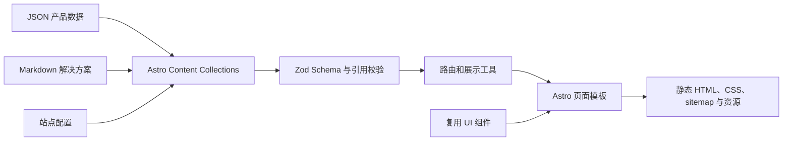

# 盛博润通信设备官网

这是一个面向专业通信设备与行业解决方案公司的内容驱动型企业官网。

本项目由我独立完成设计与开发，工作范围覆盖信息架构、响应式 UI、前端架构、内容建模、自动化测试、SEO 以及生产部署流程。

[访问线上网站](https://www.shengborun.com/) · [English README](./README.md)


## 项目概览

| | |
| --- | --- |
| **个人角色** | 独立设计与开发 |
| **工作范围** | UX/UI、前端架构、内容建模、测试、SEO、部署 |
| **产品内容** | 4 个产品分类、49 个已发布产品 |
| **解决方案** | 6 个行业解决方案页面 |
| **交付形式** | 静态生成的生产网站 |

## 项目挑战

这个项目需要呈现层级较深、数量较多的专业通信产品，同时承载长篇行业解决方案内容，并为用户提供从内容浏览到产品咨询的清晰路径。

核心工程问题并不是制作某一个页面，而是建立一套可以长期维护的系统：结构化业务内容、复用组件、动态路由、内容校验、响应式设计和生产发布流程需要彼此解耦，同时保持一致性。

## 核心成果

- 建立包含颜色、间距、字体、圆角和交互状态的响应式设计体系。
- 使用 Astro Content Collections 和严格的 Zod Schema 管理产品、分类与解决方案内容。
- 在构建阶段生成产品分类、产品详情和解决方案动态路由。
- 抽象产品卡片、分类导航、产品详情、技术参数、面包屑、Header、Footer 与 SEO 等复用组件。
- 针对宽屏桌面、平板、标准手机和 320 px 窄屏完成响应式适配。
- 实现 canonical URL、Open Graph、页面描述、语义化结构、跳转主内容链接和 sitemap。
- 建立跨内容引用校验，在发布前发现重复 ID、无效分类关系和未知产品特性。
- 使用 Vitest 和 Playwright 覆盖内容规则、路由、布局、导航、产品展示和页面元数据。
- 编写静态网站生产发布、检查与回滚流程。

## 关键工程设计

### 内容与页面实现分离

产品和产品分类使用结构化 JSON，长篇解决方案使用 Markdown。Astro Content Collections 通过明确的 Schema 加载这些内容，使新增产品主要成为内容维护工作，而不是重复开发页面。

### 确定性的静态路由

共享工具会过滤并排序已发布的分类和产品，再由 Astro 在构建阶段生成页面：

```text
/products/
/{category}/
/{category}/{product}/
/solutions/{solution}/
```

### 构建前内容校验

项目会检查单个内容文件以及文件之间的关系，包括：

- 重复的分类或产品 ID；
- 产品引用不存在的分类；
- 已发布产品引用未定义的产品特性；
- 不符合规则的 slug 和多余字段。

错误内容会直接阻止构建，避免产生不可访问或内容错误的生产页面。

### 面向内容边界的组件设计

组件围绕稳定的展示概念划分，例如产品卡片、产品主视觉、技术参数、解决方案卡片、导航和 SEO。页面负责路由与组合，复用组件负责具体展示行为。

### 可验证的响应式设计

Playwright 测试覆盖导航可用性、横向溢出、卡片尺寸、分类布局、产品详情、技术参数、元数据和面包屑，并在多个视口尺寸下验证页面行为。

## 架构



## 技术栈

| 领域 | 技术 |
| --- | --- |
| 框架 | Astro 6 |
| 语言 | TypeScript、Astro strict mode |
| 内容系统 | Astro Content Collections、JSON、Markdown、Zod |
| UI | Astro 组件、Scoped CSS、Lucide 图标 |
| 单元测试 | Vitest |
| 端到端测试 | Playwright、Chromium |
| 包管理 | pnpm |
| 构建输出 | 静态 HTML、CSS、图片资源及自动生成的 sitemap |

## 本地运行

### 环境要求

- 与 Astro 6 兼容的 Node.js
- pnpm
- Google Chrome，用于运行当前配置的 Playwright 项目

### 安装和启动

```bash
git clone https://github.com/TLzmmmmmmmm/Shengborun.git
cd Shengborun
pnpm install
pnpm dev
```

Astro 默认在 `http://localhost:4321` 启动开发服务器。

### 常用命令

```bash
pnpm dev               # 启动开发服务器
pnpm run check         # 执行 Astro 检查
pnpm run validate:content
pnpm run test:unit     # 执行 Vitest
pnpm run build         # 校验内容并生成静态网站
pnpm run test:e2e      # 对生产预览执行 Playwright
pnpm test              # 执行完整验证流程
```

## 项目结构

```text
src/
├── components/        布局、产品和解决方案复用组件
├── config/            生产站点配置
├── content/           产品、分类、方案、特性和站点内容
├── data/              展示层数据
├── layouts/           页面与政策文档布局
├── lib/               内容校验、路由和展示工具
├── pages/             Astro 静态与动态路由
└── styles/            全局样式和设计变量
scripts/               跨内容引用校验脚本
tests/
├── unit/              Vitest 测试
└── e2e/               Playwright 浏览器测试
public/                生产图片、图标与搜索引擎文件
```

## 这个项目体现的能力

- 独立完成行业级网站从设计到上线的完整交付。
- 将复杂业务资料转换为可维护的内容架构。
- 将 UI 设计决策实现为可复用的响应式系统。
- 通过内容校验和确定性路由保证数据与页面可靠性。
- 从逻辑、生成页面和浏览器行为三个层面建立测试保障。
- 综合考虑 SEO、可访问性、发布安全与长期维护成本。

## 内容与使用说明

本仓库作为个人工程作品集公开展示。项目中的公司名称、商标、产品资料和视觉素材，其权利归相应权利人所有；本仓库不授予对上述材料的再使用许可。
